# 🛍 **Clothing Store Demo**

This project is a **demonstration of an e-commerce web app** built with **React 19**, **Material-UI (MUI)**, **Redux Toolkit**, **Formik**, **React Router**, and **Storybook**.
It showcases advanced UI components, theming (light/dark), RTL/LTR direction support, global theme management via custom ThemeContext, and a functional shopping cart system.

🌐 **Live Demos**

* [Netlify - App Demo](https://clothing-store-demo.netlify.app/) <!-- Update with your link -->
* [GitHub Pages - Storybook](https://adimalka14.github.io/clothing-store-demo) <!-- Update with your link -->

🌐 Live API
* The mock API (json-server) is deployed and publicly accessible:
👉 https://clothing-order-demo.onrender.com

* You can test endpoints like:

  * https://clothing-order-demo.onrender.com/products

  * https://clothing-order-demo.onrender.com/cart


---

## 🚀 **Features**

### 🛒 E-Commerce Functionality

* Product listing with dynamic data (via json-server mock API)
* Product details page with variant & quantity selection
* Shopping cart with add/update/remove functionality
* Light/dark mode + RTL/LTR support
* Responsive design using MUI Grid/Flex
* SPA navigation with react-router-dom
* Custom ThemeContext powered by useContext for theme and direction management

---

### 🧩 **Wrapped MUI Components**

| Component             | MUI Base                                                                              | Key Features                                        |
| --------------------- | ------------------------------------------------------------------------------------- | --------------------------------------------------- |
| **Button**            | [@mui/material/Button](https://mui.com/material-ui/react-button/)                   | Loading state, variants, Storybook controls         |
| **IconButton**        | [@mui/material/IconButton](https://mui.com/material-ui/react-button/)               | Badge support for counts (e.g. cart count)          |
| **TextField**         | [@mui/material/TextField](https://mui.com/material-ui/react-text-field/)            | Adornments, multiline, password toggle              |
| **Select**            | [@mui/material/Select](https://mui.com/material-ui/react-select/)                   | Standardized API with helper text and error display |
| **Tooltip**           | [@mui/material/Tooltip](https://mui.com/material-ui/react-tooltip/)                 | Custom placements, wraps any element                |
| **AppBar**            | [@mui/material/AppBar](https://mui.com/material-ui/react-app-bar/)                  | Top bar with theme toggle, cart icon                |
| **ToggleButtonGroup** | [@mui/material/ToggleButtonGroup](https://mui.com/material-ui/react-toggle-button/) | Variant selector with icon support                  |

---

## 🎨 **Theming & Direction**

* Light/dark themes via ThemeProvider
* Direction support (LTR/RTL) with DirectionWrapper + Emotion cache + [stylis-plugin-rtl](https://github.com/Emotion-js/rtl)
* Theme/direction switch in AppBar

---

## 📖 **Storybook**

* Interactive documentation of all components
* Variants (sizes, themes, icons) displayed
* Useful for design review and isolated testing

---

## ⚡ **Run Locally**

Clone the repo:

bash
git clone https://github.com/adimalka14/clothing-store-demo.git


Install dependencies:

```
bash
npm install
```

Run the app:
```
bash
npm run dev          # run the app locally
npm run start:server # start the mock json-server backend
npm run storybook    # run Storybook
```

Build Storybook:
```
bash
npm run build-storybook
```

---

## 📦 **Environment**

* **Node.js**: >= 22
* **React**: ^19.x
* **Redux Toolkit**: ^2.x
* **Formik**: ^2.x
* **React Router DOM**: ^7.x
* **Storybook**: 9.x
* **Vite**: ^7.x

---

## 🛠 **Libraries & Tools**

### ✨ Main Dependencies

| Library                                                                                               | Purpose                      |
| ----------------------------------------------------------------------------------------------------- | ---------------------------- |
| [@mui/material](https://mui.com/)                                                                   | UI components                |
| [@mui/icons-material](https://mui.com/material-ui/material-icons/)                                  | MUI's icon set               |
| [@emotion/react](https://emotion.sh/docs/introduction), [stylis-plugin-rtl](https://emotion.sh/) | CSS-in-JS + RTL              |
| [@reduxjs/toolkit](https://redux-toolkit.js.org/)                                                   | State management             |
| [react-redux](https://react-redux.js.org/)                                                          | React bindings for Redux     |
| [formik](https://formik.org/)                                                                       | Forms management             |
| [yup](https://github.com/jquense/yup)                                                               | Validation schema            |
| [react-router-dom](https://reactrouter.com/)                                                        | Routing and navigation (SPA) |
| [json-server](https://github.com/typicode/json-server)                                              | Mock REST API server         |
| [axios](https://axios-http.com/)                                                                    | HTTP requests (optional use) |
| [prop-types](https://www.npmjs.com/package/prop-types)                                              | Runtime props validation     |

### 🛠 Dev & Build Tools

| Tool                                                                | Purpose                            |
| ------------------------------------------------------------------- | ---------------------------------- |
| [storybook](https://storybook.js.org/)                            | Component documentation/playground |
| [vite](https://vitejs.dev/)                                       | Fast bundler                       |
| [eslint](https://eslint.org/), [prettier](https://prettier.io/) | Linting & formatting               |

---

## 📁 **Project Structure**

```
src/
 ├── components/          # UI components (ProductCard, CartItem, etc.)
 ├── base-components/     # Wrapped MUI components
 ├── pages/               # App pages (Home, ProductPage, CartPage)
 ├── store/               # Redux Toolkit setup (slices, thunks)
 ├── themes/              # ThemeProvider, theme definitions
 ├── services/            # Hooks for interacting with store/api
 ├── api/                 # API calls
 └── utils/               # Utility functions (env, constants)
```

---

## 📸 Screenshots / Demo

## Home Page

### Desktop
#### Plan
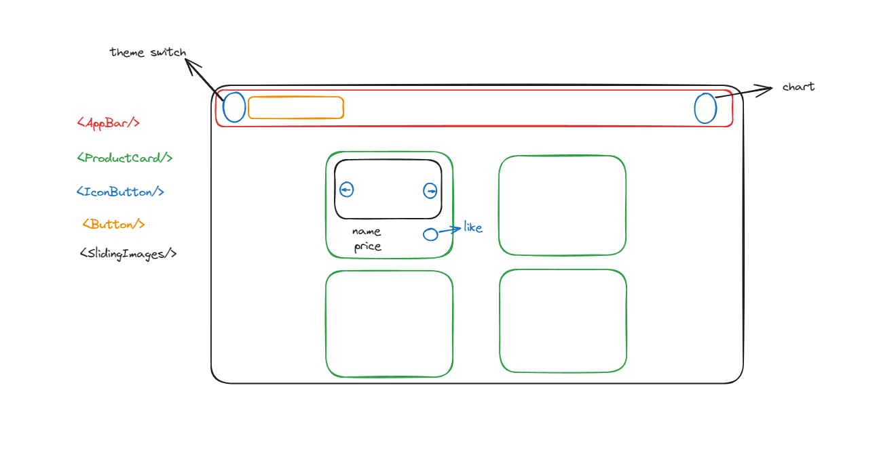

#### result
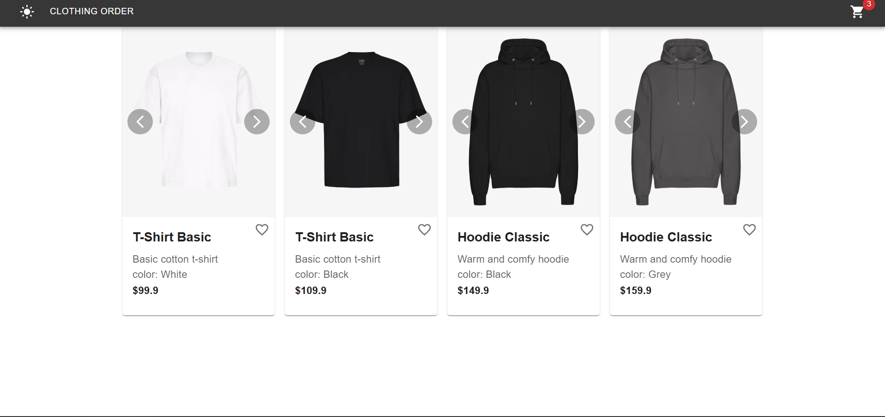

### Mobile
#### Plan
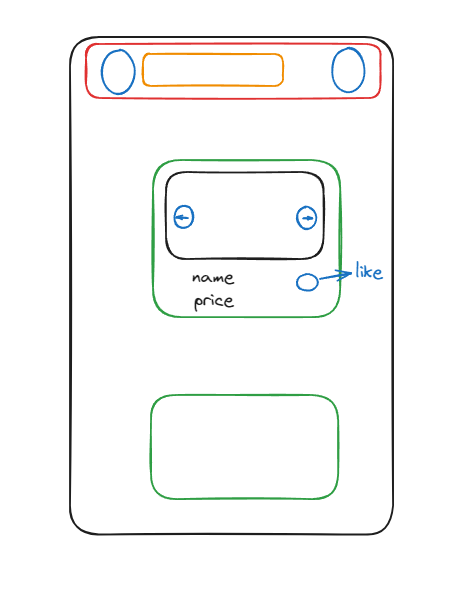

#### result
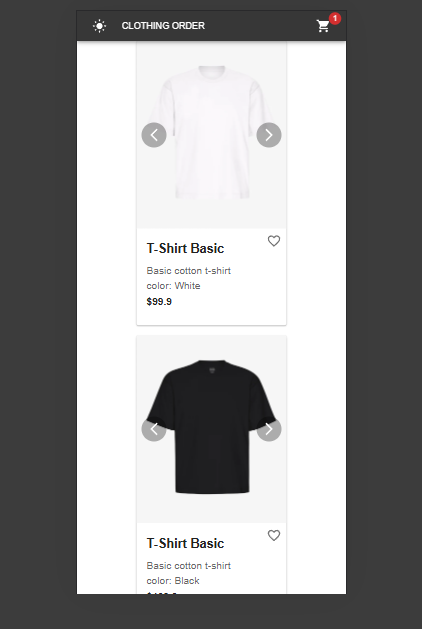

---

## Product Page

### Desktop
#### Plan
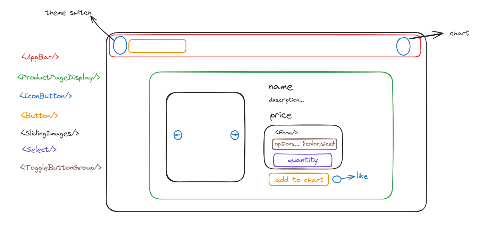

#### result
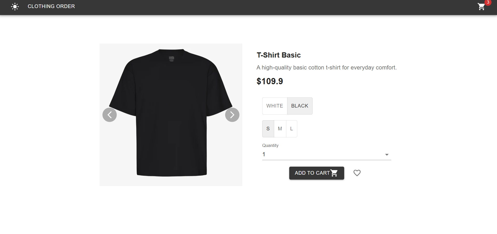

### Mobile
#### Plan
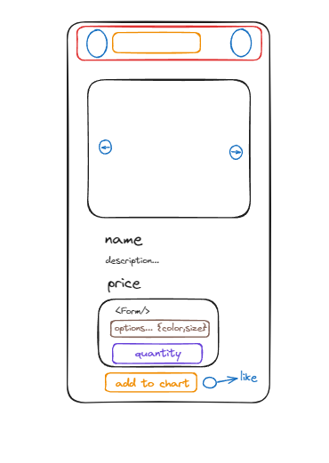

#### result
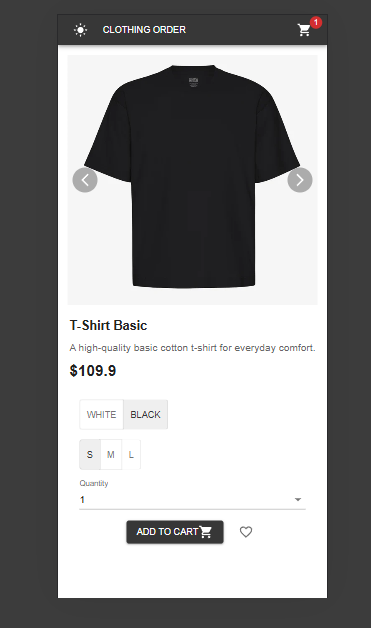

---

## Cart Page

### Desktop
#### Plan
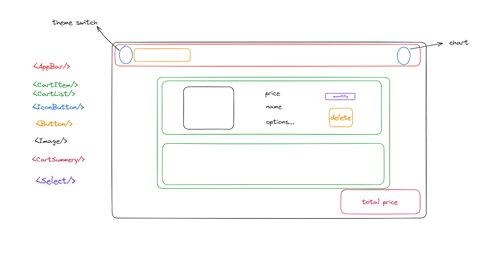

#### result
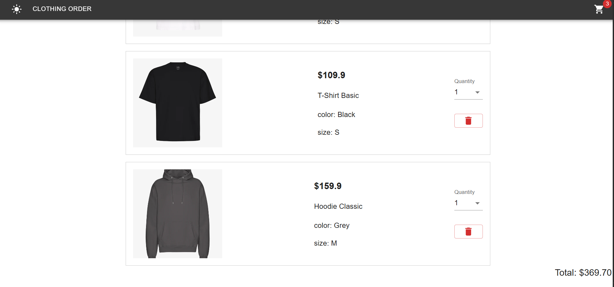

### Mobile
#### Plan
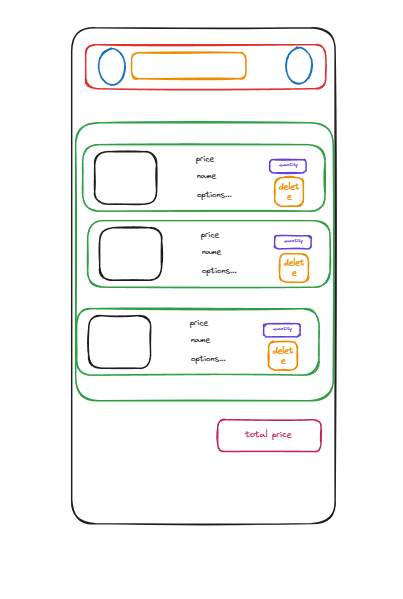

#### result
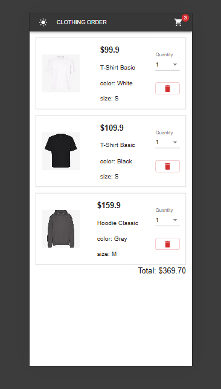


---


## 📐 **Data Model (Derived from json-server)**

Our mock API is designed as if backed by a normalized database. Here's the assumed DB structure:

### 🗄 Products

| Field       | Type    | PK |
| ----------- | ------- | -- |
| product\_id | INT     | ✅  |
| name        | VARCHAR |    |
| description | TEXT    |    |

### 🗄 Options

| Field       | Type    | PK | FK                   |
| ----------- | ------- | -- | -------------------- |
| option\_id  | INT     | ✅  |                      |
| product\_id | INT     |    | Products.product\_id |
| name        | VARCHAR |    |                      |

### 🗄 OptionValues

| Field      | Type    | PK | FK                 |
| ---------- | ------- | -- | ------------------ |
| value\_id  | INT     | ✅  |                    |
| option\_id | INT     |    | Options.option\_id |
| value      | VARCHAR |    |                    |

### 🗄 Variants

| Field          | Type    | PK | FK                   |
| -------------- | ------- | -- | -------------------- |
| variant\_id    | VARCHAR | ✅  |                      |
| product\_id    | INT     |    | Products.product\_id |
| price          | DECIMAL |    |                      |
| stock          | INT     |    |                      |
| image\_set\_id | VARCHAR |    |                      |

### 🗄 VariantOptionValues

| Field       | Type    | PK | FK                     |
| ----------- | ------- | -- | ---------------------- |
| variant\_id | VARCHAR | ✅  | Variants.variant\_id   |
| value\_id   | INT     | ✅  | OptionValues.value\_id |

### 🗄 ImageSets

| Field          | Type    | PK |
| -------------- | ------- | -- |
| image\_set\_id | VARCHAR | ✅  |

### 🗄 Images

| Field          | Type    | PK | FK                       |
| -------------- | ------- | -- | ------------------------ |
| image\_id      | INT     | ✅  |                          |
| image\_set\_id | VARCHAR |    | ImageSets.image\_set\_id |
| src            | VARCHAR |    |                          |
| alt            | VARCHAR |    |                          |

### 🗄 Cart

| Field       | Type    | PK | FK                   |
| ----------- | ------- | -- | -------------------- |
| cart\_id    | VARCHAR | ✅  |                      |
| variant\_id | VARCHAR |    | Variants.variant\_id |
| quantity    | INT     |    |                      |

---

## 🚀 **Assumptions & Design Notes**

* The json-server data simulates fully joined API responses.
* Stock is per variant.
* Variants are linked to options via VariantOptionValues.
* Variants have grouped images via ImageSets.
* Cart holds variant + quantity only.

---

## 🛠 **Example SQL Queries Behind the Mock API Routes**

### `/products`

```sql
SELECT p.product_id, p.name, p.description, v.variant_id, v.price, v.stock
FROM Products p
JOIN Variants v ON p.product_id = v.product_id;
```

### `/productDetails/:id`

```sql
SELECT json_build_object(
               'productId', p.product_id,
               'name', p.name,
               'description', p.description,
               'options', (
                   SELECT json_agg(json_build_object(
                           'name', o.name,
                           'values', (SELECT array_agg(ov.value) FROM OptionValues ov WHERE ov.option_id = o.option_id)
                                   )) FROM Options o WHERE o.product_id = p.product_id
               ),
               'variants', (
                   SELECT json_agg(json_build_object(
                           'variantId', v.variant_id,
                           'price', v.price,
                           'stock', v.stock,
                           'optionValues', (
                               SELECT json_object_agg(o.name, ov.value)
                               FROM VariantOptionValues vov
                                        JOIN OptionValues ov ON vov.value_id = ov.value_id
                                        JOIN Options o ON ov.option_id = o.option_id
                               WHERE vov.variant_id = v.variant_id
                           ),
                           'images', (
                               SELECT json_agg(json_build_object('src', i.src, 'alt', i.alt))
                               FROM Images i
                                        JOIN ImageSets iset ON i.image_set_id = iset.image_set_id
                               WHERE iset.image_set_id = v.image_set_id
                           )
                                   )) FROM Variants v WHERE v.product_id = p.product_id
               )
       ) FROM Products p WHERE p.product_id = :id;
```

### `/cart`

```sql
SELECT c.cart_id, c.variant_id, c.quantity, v.price
FROM Cart c
         JOIN Variants v ON c.variant_id = v.variant_id;
```

---

## 🙌 **Credits**

Created by **Adi Malka** as a personal project to showcase frontend architecture, DB thinking, and mock API design.
